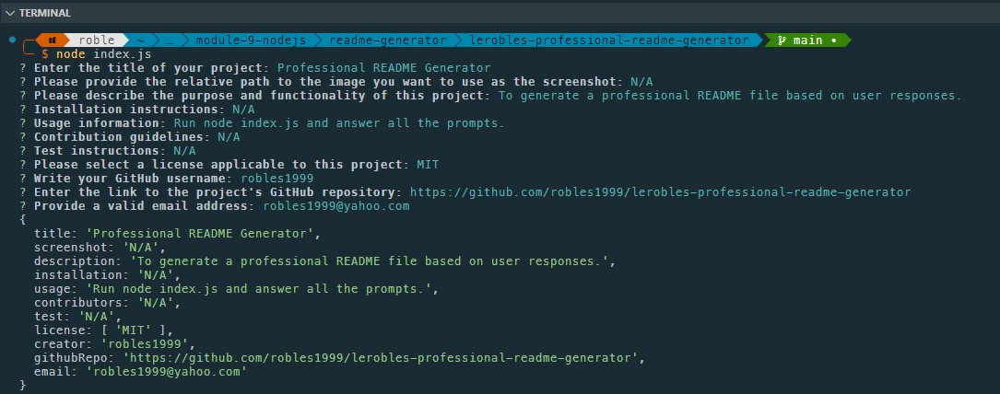

# Professional README.md Generator 

## Description
To generate a professional README.md file based on user responses.
## Screenshot

## Table of Contents
* [Installation](#installation)
* [Usage](#usage)
* [Contributors](#contributors)
* [Testing](#testing)
* [Questions](#questions)
* [License](#license)
## Installation
n/a
## Usage
Run node index.js and answer all the prompts as needed.
## Contributors
n/a
## Testing
n/a
## Questions
Please send your questions [here](mailto:robles1999@yahoo.com?subject=[GitHub]%20README%20Generator) or visit the [GitHub repo.](https://github.com/robles1999/lerobles-professional-readme-generator).
## License
    Licensed under the MIT license.
    
